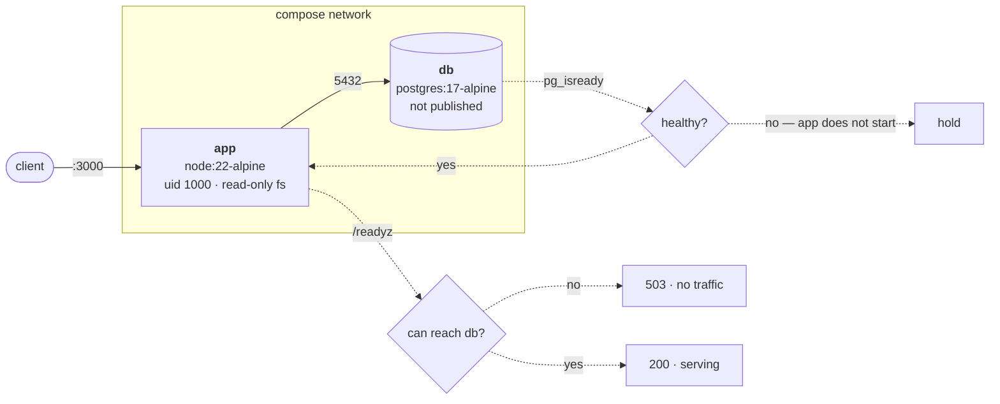

<div align="center">

# docker-node-postgres-stack

**A production-shaped container stack for Node and Postgres.**

Multi-stage build · non-root · read-only filesystem · health-gated startup

[](https://github.com/Gautam-CyberSec/docker-node-postgres-stack/actions/workflows/ci.yml)
[](compose.yaml)
[](Dockerfile)
[](LICENSE)

[Architecture](ARCHITECTURE.md) ·
[Lessons learned](LESSONS.md) ·
[Security](SECURITY.md) ·
[Contributing](CONTRIBUTING.md) ·
[Changelog](CHANGELOG.md)

</div>

---

Most tutorial Docker stacks share the same handful of defects: the app runs as
root, the image carries its own build toolchain, Postgres is published to the
host, and startup ordering is handled by a `sleep` or a `wait-for-it` script.

This is the same stack with those decisions made properly, and with the
important claims asserted in CI rather than described in prose.

```bash
git clone https://github.com/Gautam-CyberSec/docker-node-postgres-stack.git
cd docker-node-postgres-stack
cp .env.example .env
docker compose up --build
```

```console
$ curl -s localhost:3000/readyz
{"status":"ready"}

$ curl -s -X POST localhost:3000/api/items \
    -H 'content-type: application/json' -d '{"name":"widget"}'
{"id":"1","name":"widget","created_at":"2026-08-08T18:00:38.498Z"}
```

`id` is a string because Postgres `BIGINT` exceeds what a JSON number can hold
safely — node-postgres returns it as text rather than silently losing precision
past 2^53.

## The stack



## Seven decisions worth reading

| | Decision | Why |
|---|---|---|
| 1 | **Startup is gated on a health check, not a sleep** | `depends_on: condition: service_healthy` holds the app until `pg_isready` passes. This is what `wait-for-it.sh` exists to work around. |
| 2 | **`pg_isready` names the user and database** | Without `-U` and `-d` it checks the wrong database and can report healthy before the app's database exists — the failure that makes people conclude health checks are unreliable. |
| 3 | **Liveness and readiness are different endpoints** | `/healthz` never touches Postgres. If liveness depended on the database, one brief outage would make the orchestrator restart every healthy app container and turn a blip into a restart storm. `/readyz` does check, and returns 503. |
| 4 | **Non-root, numeric UID, read-only root filesystem** | `USER 1000:1000` rather than `USER node`, because Kubernetes `runAsNonRoot` resolves the UID before `/etc/passwd` is readable. With `read_only: true`, a compromised process cannot rewrite its own code. |
| 5 | **tini as PID 1** | Node gets no default `SIGTERM` handler as PID 1, so `docker stop` waits out the full grace period and then `SIGKILL`s — a ten-second pause on every deploy and dropped in-flight requests. |
| 6 | **Postgres publishes no ports** | It is reachable over the compose network and nowhere else. Publishing 5432 "just for development" is how databases end up on the internet. |
| 7 | **npm is deleted from the runtime image** | Nothing at runtime needs a package manager — the entrypoint is `node`. Removing it took the image from 8 HIGH/CRITICAL CVEs to none, and every one of them was in npm's own bundled dependencies rather than in application code. |

Full reasoning, including what was rejected, is in **[ARCHITECTURE.md](ARCHITECTURE.md)**.

### Measured, not asserted

Both figures come from the CI run on `main`, which builds a single-stage version
of the same application for comparison:

| Image | Size | HIGH/CRITICAL CVEs |
|---|---|---|
| **This stack** — Alpine + node binary | **137 MB** | **0** |
| Single-stage `node:22-alpine` | 162 MB | 8 |

Every one of those 8 findings was in npm's own bundled dependencies — `tar`,
`sigstore`, `brace-expansion` — and none in application code. Deleting npm after
the fact does not help: `rm` in a later layer writes whiteouts rather than
reclaiming bytes, and made the image *larger*. Never adding it is the only way to
remove it.

## What CI verifies

Claims in a README age badly, so the ones that matter are tested on every push:

| Check | Asserts |
|---|---|
| `hadolint` | Dockerfile lints clean at warning threshold |
| Unit tests, Node 20 and 22 | 14 tests, including that `/healthz` never touches the database |
| Image build | `Config.User` is `1000:1000` — the build fails if it regresses to root |
| Image size | Multi-stage measured against a single-stage build of the same app, reported in the job summary |
| Trivy | 0 fixable HIGH/CRITICAL findings |
| Compose stack | Real stack starts, and the smoke suite runs against it |
| Smoke tests | uid is 1000, `/app` is not writable, `/tmp` is, Postgres is unreachable from the host, a row survives a write-then-read |
| Trivy | Fails on fixable HIGH/CRITICAL CVEs |

## Layout

```
├── Dockerfile              multi-stage: deps · build+test · runtime
├── compose.yaml            app + postgres, health-gated
├── .env.example            runtime configuration template
├── app/
│   ├── src/                server, db access, entrypoint
│   └── test/               14 unit tests, no database required
├── db/init.sql             schema, applied on first start only
└── scripts/smoke.sh        end-to-end checks against a running stack
```

## Development

```bash
make check     # hadolint, shellcheck and the unit tests — no Docker needed
make up        # build and start the stack
make smoke     # end-to-end checks
make size      # measure the runtime image
make scan      # Trivy vulnerability scan
make down      # stop and remove the volume
```

The HTTP layer takes its repository as a parameter, so the unit suite drives
every path — including the database being unreachable — with no Postgres
running. The container behaviour that cannot be unit tested is covered by
`scripts/smoke.sh` against a real stack.

## Configuration

Every value is read at runtime; nothing is baked into the image, so the same
artefact runs in every environment.

| Variable | Default | Purpose |
|---|---|---|
| `POSTGRES_USER` | — | Required. Database user |
| `POSTGRES_PASSWORD` | — | Required. Database password |
| `POSTGRES_DB` | — | Required. Database name |
| `POSTGRES_HOST` | `db` | Set by compose |
| `POSTGRES_PORT` | `5432` | |
| `POSTGRES_POOL_MAX` | `10` | Maximum pooled connections |
| `APP_PORT` | `3000` | Host port the API is published on |

Compose fails fast with a named error if a required variable is missing, rather
than starting a container that cannot work.

## Security

Non-root with a numeric UID, read-only root filesystem, `no-new-privileges`,
no published database port, no secrets in any layer, and a Trivy gate on
fixable HIGH/CRITICAL findings. Details and the reporting route:
[SECURITY.md](SECURITY.md).

## Roadmap

- [ ] A migration tool in place of the one-shot `init.sql`
- [ ] Structured JSON logging with request IDs
- [ ] Multi-architecture images (`linux/amd64`, `linux/arm64`)
- [ ] Kubernetes manifests using the same probes
- [ ] Signed images and an SBOM

## Engineering decisions &amp; lessons learned

Seven mistakes made while building this, and what each one changed — including
an image that grew when npm was deleted from it, a security gate that silently
never ran, and a README that quoted output no machine had produced.

**[Read the retrospective →](LESSONS.md)**

## Licence

[MIT](LICENSE)

---

<div align="center">

**Gautam** · Cloud &amp; Backend Engineer

[Portfolio](https://Gautam-cloud.com) ·
[LinkedIn](https://linkedin.com/in/gautam-cybersec) ·
[gautamdem@gmail.com](mailto:gautamdem@gmail.com)

</div>
